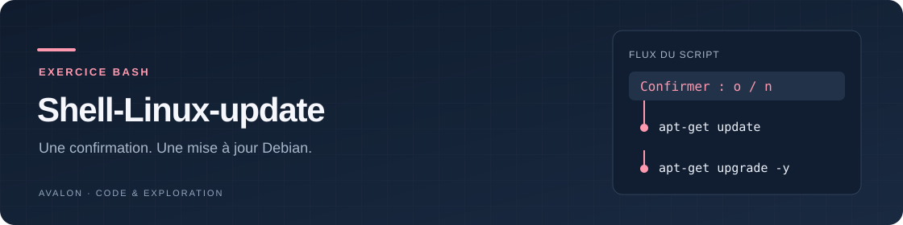

<div align="center">



# Shell-Linux-update

**Comprendre une mise à jour Debian à travers un court dialogue Bash.**

Un script d’apprentissage facile à parcourir : confirmation, actualisation
de l’index APT, puis mise à jour des paquets.

[](ScriptMAJ.sh)
[](ScriptMAJ.sh)
[](#ce-que-fait-le-script)

[Fonctionnement](#ce-que-fait-le-script) · [Utilisation](#utilisation) · [Limites](#portée-du-projet) · [Source](ScriptMAJ.sh)

</div>

Les exemples d’utilisation ci-dessous s’adressent aux personnes disposant des
autorisations nécessaires. [Droits et conditions de réutilisation](RIGHTS.md).

## Ce que fait le script

[`ScriptMAJ.sh`](ScriptMAJ.sh), également présenté sous le nom **Linux-MAJ**,
demande `Initialiser le script de mise à jour ? (o/n)` puis suit ce choix :

| Réponse | Action |
|---|---|
| `o` | lance `apt-get update`, puis `apt-get upgrade -y` si la première commande réussit |
| Toute autre réponse | affiche un message de fermeture sans lancer APT |

Le script ne lance ni `dist-upgrade`, ni nettoyage de paquets, ni redémarrage.

## Utilisation

Prérequis : Debian, Bash, APT et les droits nécessaires à la gestion des
paquets. Le script ne vérifie pas lui-même les privilèges.

```bash
git clone https://github.com/AdrienAvalon/Shell-Linux-update.git
cd Shell-Linux-update
less ScriptMAJ.sh
sudo bash ScriptMAJ.sh
```

Répondre `o` autorise la mise à jour des paquets : l'option `-y` répond ensuite
automatiquement aux confirmations APT habituelles. Prévoyez les éventuelles
conséquences des mises à jour sur les services de la machine.

## Portée du projet

Écrit le **28 février 2020** par **Adrien CROS**, ce script constitue un
exemple simple d'administration Linux interactive. Il ne fournit pas de
sauvegarde, de retour arrière ou de journal dédié.

Le message final « Fin de la mise à jour » est affiché même si APT a échoué,
et le code de sortie d'APT n'est pas conservé. Il faut donc lire la sortie
des commandes ; ce script n'est pas conçu pour piloter une mise à jour
automatisée à partir de son seul code de retour.

## Contribuer et réutiliser

Les corrections peuvent être proposées dans les
[issues](https://github.com/AdrienAvalon/Shell-Linux-update/issues) ou par pull
request. Les contributions originales non déjà licenciées restent à
[droits réservés](RIGHTS.md). Réutilisation et exploitation commerciale nécessitent
un accord écrit préalable ; la rémunération commerciale est convenue dans cet accord.
